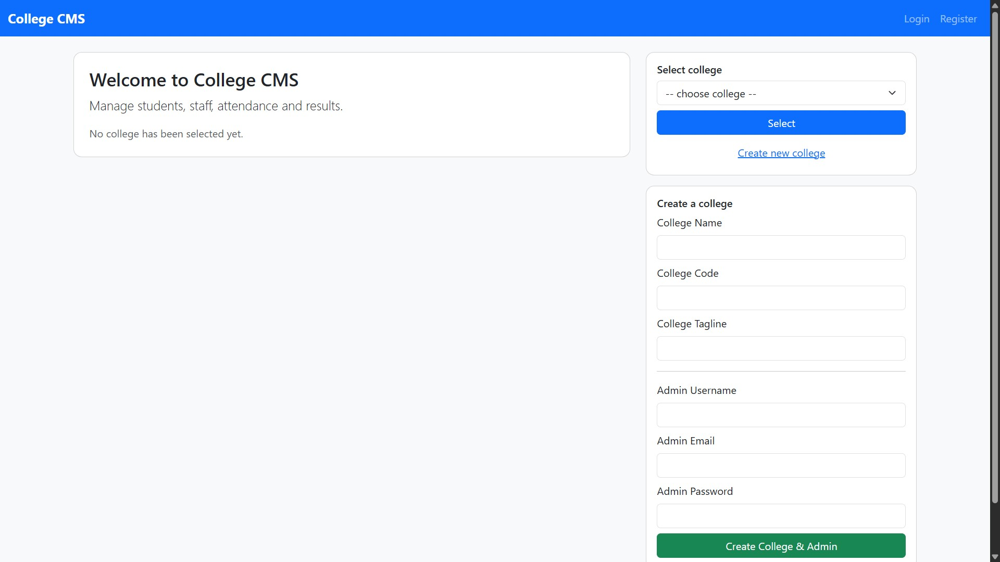
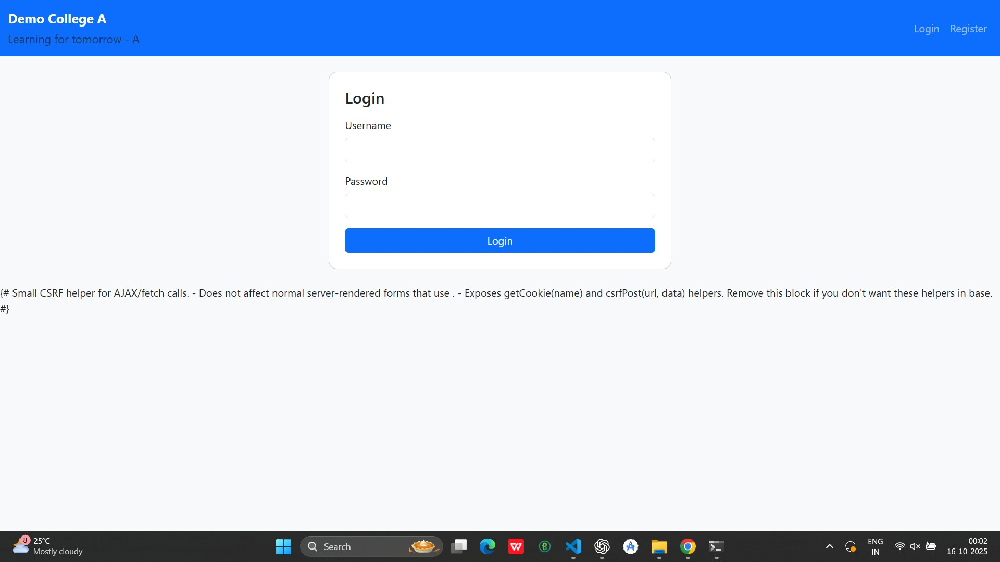
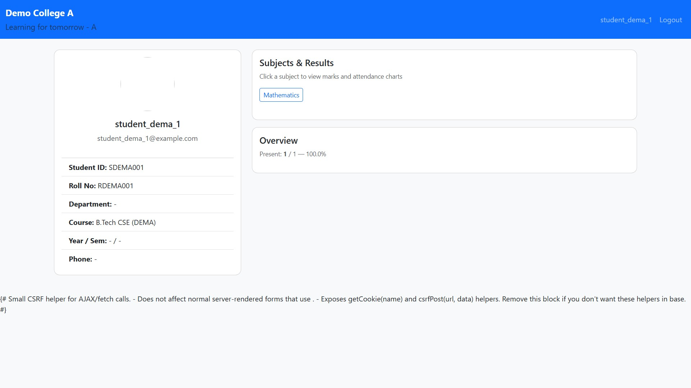
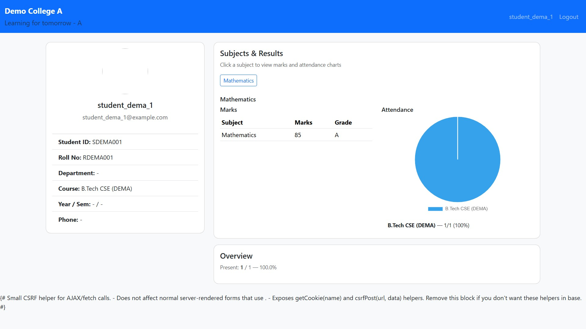
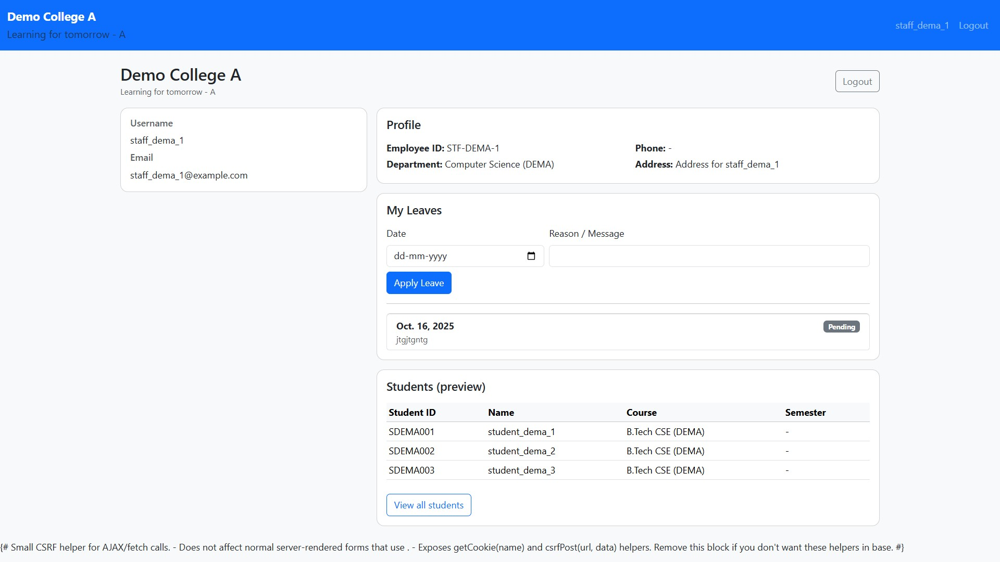
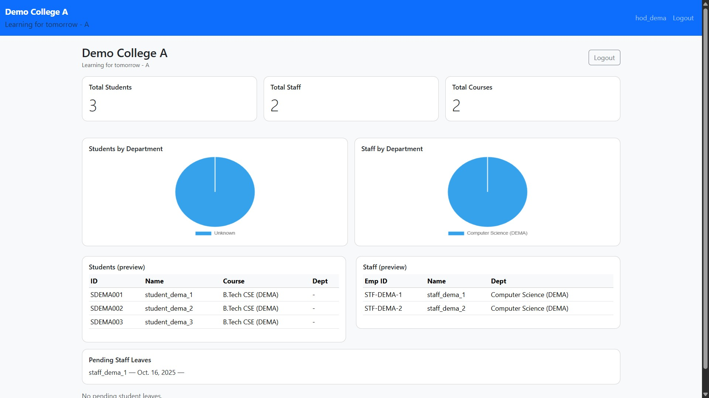

# 🎓 College Management System (CMS)

A full-featured **College Management System** built using **Django**, offering a clean and efficient interface for **Admins (HODs)**, **Staff**, and **Students**.  
It enables colleges to manage **students, staff, attendance, leaves, and results** seamlessly with secure authentication and role-based dashboards.

---

## 🚀 Features

### 👨‍💼 Admin / HOD
- Manage students, staff, departments, courses, and sessions  
- Approve or reject leave requests from staff and students  
- View detailed statistics (students & staff by department)  
- Interactive dashboards with **Chart.js pie charts**  
- Access attendance records and results  
- College creation and admin assignment  

### 👩‍🏫 Staff
- View and manage student details per semester/course  
- Mark attendance for students  
- Add or edit student results  
- Apply for leave with message and date  
- See leave approval status and HOD replies  
- Interactive student lists and data preview  

### 🎓 Students
- View attendance history and subject-wise percentages  
- View grades, marks, and progress in tabular + chart form  
- Apply for leave and track approval status  
- Submit feedback to faculty or administration  
- Personalized dashboard showing course, semester, and department details  

### 🌐 General
- Role-based access and dashboard routing  
- College selector with the ability to create a new college  
- Secure authentication with CSRF protection  
- Responsive **Bootstrap 5** UI with consistent design  
- Custom User Model with multi-role support  
- Clean Django structure with modular apps  
- SQLite as default DB (easily switchable to PostgreSQL/MySQL)  

---

## 🖼️ Screenshots

Below are screenshots of key pages (place your images in `screenshots/`):

### College Login / Registration


### Member Login / Registration


### Student Dashboard




### Staff Dashboard


### Admin / HOD dashboard


---

## 🛠️ Tech Stack

| Layer | Technology |
|-------|-------------|
| **Frontend** | HTML, CSS, Bootstrap 5, Chart.js |
| **Backend** | Django 5.x |
| **Database** | SQLite (default), PostgreSQL/MySQL supported |
| **Language** | Python 3.12+ |
| **Auth System** | Django Authentication (Custom User Model) |
| **Template Engine** | Django Templates |

---

## ⚙️ Installation & Setup

### 1️⃣ Clone the Repository
```bash
git clone https://github.com/Ashy-21/CMS.git
cd CMS
